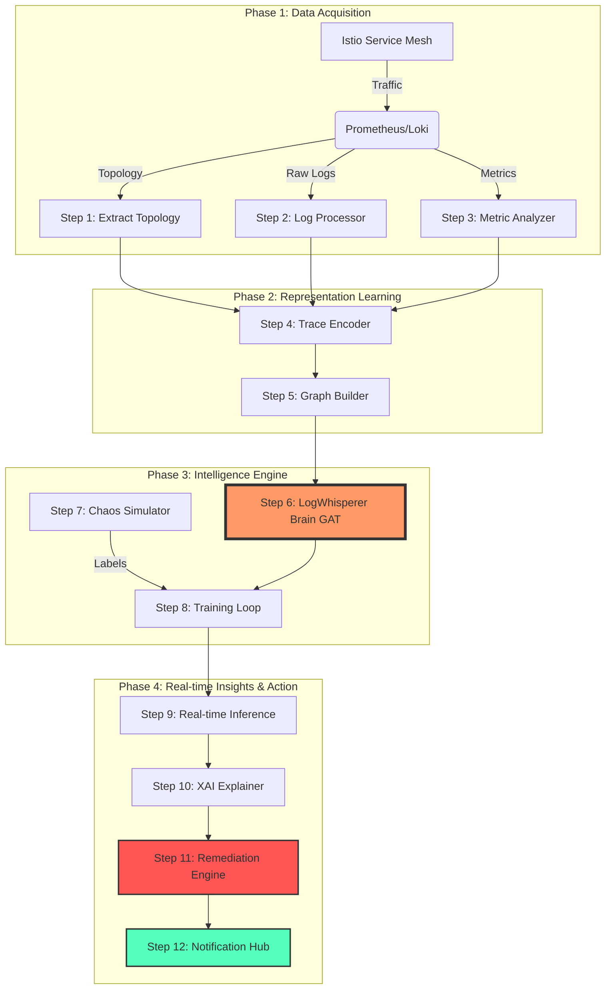

# 🎙️ LogWhisperer: Automated Root Cause Analysis

> **Harnessing the Power of Graph Neural Networks (GNNs) and Service Mesh Telemetry to Silence the Noise and Find the Signal.**

LogWhisperer is a state-of-the-art Automated Root Cause Analysis (RCA) system designed for complex, high-scale microservice architectures. By fusing multi-modal data—Logs, Metrics, and Traces—into a unified graph-based representation, LogWhisperer identifies the origins of system failures with unprecedented accuracy.

---

## 🛠️ The Pipeline Workflow

The LogWhisperer engine follows a rigorous 12-step process from raw telemetry to automated remediation.



---

## 🚀 Key Features

- **🌐 Multi-Modal Fusion**: Seamlessly integrates logs (NLP via LogBERT), metrics (Temporal features), and traces (Structural features).
- **🧠 GNN-Powered Brain**: Utilizes Graph Attention Networks (GAT) to model complex dependencies and cascading failures.
- **⚡ Real-time Detection**: Parallel processing of telemetry streams for near-instant RCA.
- **🔍 Explainable AI (XAI)**: Don't just get a result; understand the *why* with human-readable explanations.
- **🛠️ Automated Remediation**: Suggests (and can execute) `kubectl` commands to fix the root cause.
- **📢 Multi-Channel Alerting**: Built-in Slack/Webhook notification engine for incident response.

---

## 📁 Component Deep Dive

| Step | Script | Responsibility |
| :--- | :--- | :--- |
| **1** | `step1_extract_topology.py` | Queries Prometheus for live service dependency graphs. |
| **2** | `step2_log_processor.py` | Converts unstructured logs into semantic vectors using LogBERT. |
| **3** | `step3_metric_analyzer.py` | Normalizes anomaly-sensitive metrics (Latency, Error Rates). |
| **4** | `step4_trace_encoder.py` | Encodes user request paths into high-dimensional trace embeddings. |
| **5** | `step5_graph_builder.py` | Fuses topology and features into a unified `PyTorch Geometric` graph. |
| **6** | `step6_model.py` | The GAT architecture—the core intelligence of LogWhisperer. |
| **7** | `step7_chaos_simulator.py` | Injects synthetic failures (Latency spikes, Pod kills) for training. |
| **8** | `step8_train.py` | The supervised training loop for the GNN brain. |
| **9** | `step9_inference.py` | Live monitoring and anomaly localization. |
| **10** | `step10_explainer.py` | Interprets model weights into human-readable root causes. |
| **11** | `step11_remediation.py` | **(Industrial)** Maps root causes to `kubectl` remediation scripts. |
| **12** | `step12_notifier.py` | **(Industrial)** Dispatches incident reports to Slack/Teams/Webhooks. |

---

## 💻 Tech Stack

- **Frameworks**: PyTorch, PyTorch Geometric, HuggingFace Transformers
- **Infrastructure**: Istio, Prometheus, Fluent-Bit, Loki, Kubernetes
- **Language**: Python 3.9+
- **Libraries**: NetworkX, Pandas, Scikit-Learn

---

## 🏁 Getting Started

### Prerequisites
- Kubernetes Cluster with **Istio** installed.
- **Prometheus** & **Loki** accessible via your network.

### Installation
1. Clone the repository:
   ```bash
   git clone https://github.com/your-repo/rca_system.git
   ```
2. Install dependencies:
   ```bash
   pip install -r requirements.txt
   ```

### Running the System
Start the live inference loop with industrial extensions:
```bash
python scripts/step9_inference.py
```

---
*Created by Antigravity AI for the next generation of SREs.*
